**Day 3 Accounting**

[TOC]

Accounting answers these basic questions:

What does a company own?

How much does a company owe others?

How well did a company's operations perform?

How does the company get the cash to found itself?

# 1. Accounting Rules

GAAP - Generally Accepted Accounting Principles

FASB - Financial Accounting Standards Board

# 2. Accounting Concepts

## 2.1 The Entity

Accounting report communicate the activities of a specific entity.

## 2.2 Cash and Accrual Accounting

### 2.2.1 Cash basis accounting

### 2.2.2 Accrual accounting

Allocations to Accounting Periods

Matching 

## 2.3 Transaction Definition and Objectivity

Accounting records only contain transactions that have been "completed" and that have a "quantifiable" monetary value.

## 2.4 Accounting Conservatism and Historical Costs

Conservatism also dictates that transactions be recorded at their historical cost.

## 2.5 Going Concern

Values assigned in the financial statements use historical costs.

## 2.6 Consistency

The consistency rule insists that companies value their inventory the same way from year to year.

FIFO

LIFO

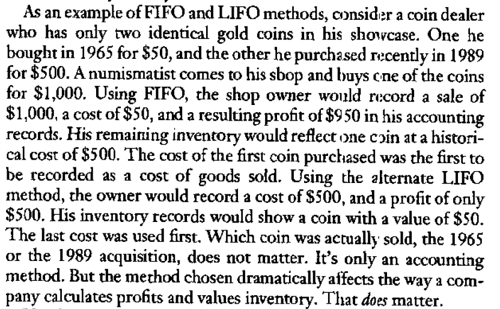

## 2.7 Materiality

Financial statements is materially correct so that a reader can get a fairly stated view of an entity.

# 3. The Financial Statements

### 3.1 The Balance Sheet

**Assets** are the resources that the company possesses for the future benefit of the bussiness

- Cash
- Inventory
- Customers receivables - accounts receivable
- Equipment
- Buildings

**Liabilities** are dollar-specific obligations to repay borrowing, debts, and other obligations to provide goods or services to others

- Bank debt
- Amounts owed to suppliers - accounts payable
- Prepaid accounts or advances from customers to deliver goods and services
- Taxes owed
- Wages owed to employees

**Owners' equity** is the accumulated dollar measure of the owners' investment in the company.

- Common stock - investment by owners
- Additional paid-in capital - investment by owners
- Retained earnings - reinvestment of earnings by owners 

$$
Assets(A) = Liabilities(L) + Owners'\ Equity(OE)
$$

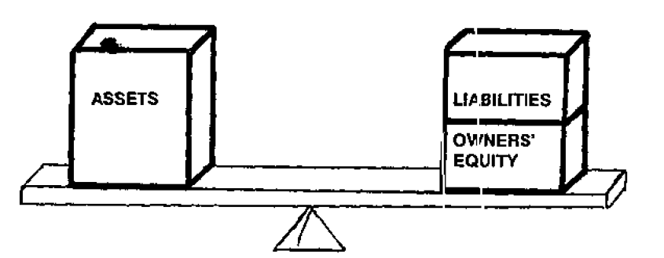

Accounting process: The Double Entry System

In all cases, journal entries have at least two lines of data, a debit and a credit.

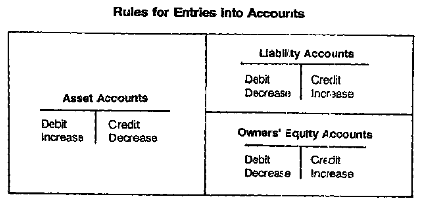

Bob and his father issued themselves 1000 shares of stock for their initial investment of $15000 in their store.

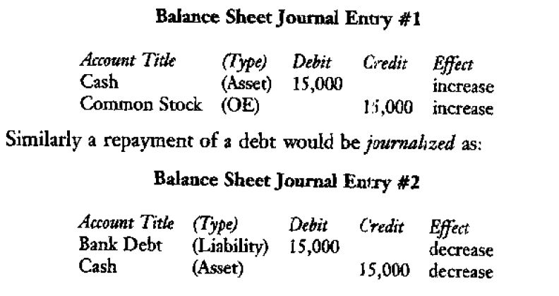

Example balance sheet

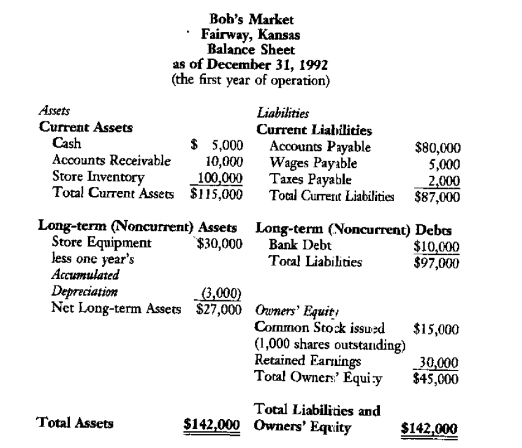

***Notes:***

- ***The total of assets equals the total of liabilities and owners' equity***
- ***Asset on the left and liabilities and OE on the right, like the journal entries***
- ***Report is as of a point of certain time***

**Liquidity: Current and Long-term Classifications**

An important aspect of the balance sheet statement is that the assets and liabilities are listed in order of their liquidity, from most liquid to least.

**Working Capital**
$$
Current\ Assets - Current\ Liabilities = Net\ Working\ Capital
$$

**How Owners' Equity(OE) Fits In**

A = L + OE            to                   OE = A  - L

### 3.2 The Income Statement

The income statement show the "flow" of activity and transactions over a specific "period" of time.

Revenue - Expenses = Income

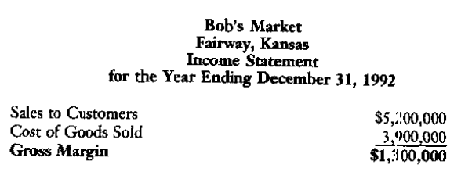

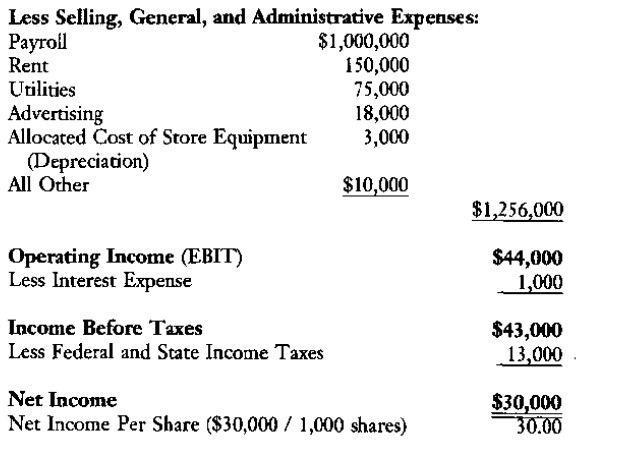

**Income Statement Terminology**

**Gross Margin** 

Gross Margin = Sales - The "Direct" Cost of the Goods or Services Sold

Beginning Inventory + New Purchases - Ending Inventory = Cost of Goods Sold

**Operating Profit**

The earnings before interest and taxes(EBIT)

**Other Expenses** is a catchall category for items not large enough to justify a separate line on the income statement

**Net Income** 

Net Income = EBIT - Interest Expense - Taxes

**How Income Statement journal Entries Are Made**

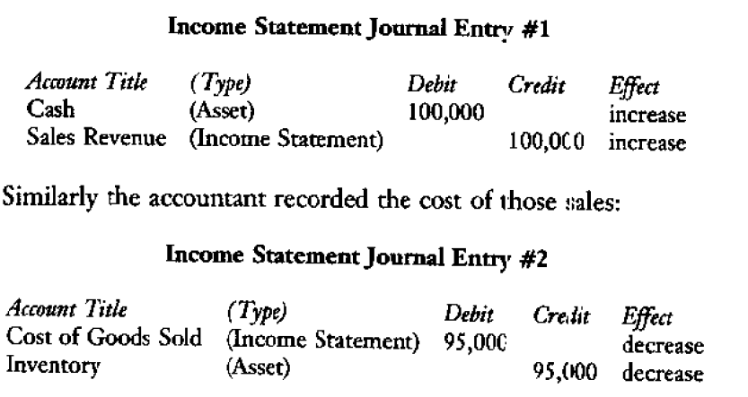

**The Income Statement's Link to the Balance Sheet**

### 3.3 The statement of Cash Flows

**The importance of Cash** - Cash is King

**The Cash Flow Statement's Link to the Balance Sheet**
$$
Assets = Liabilities + Owners'\ Equity \\
Current\ Assets + Noncurrent\ Assets = Current\ Liabilities + Noncurrent\ Liabilities + Owners'\ Equity \\
(Cash + Accounts\ Receivable(AR) + Inventory(INV)) + NCA = CL + NCL + OE \\
Cash = CL + NCL + OE - AR - INV - NCA
$$
As revealed by the quation, an increase in a current liability on the  right of the quals sign would mean an increase in cash on the left.

Conversely an increase in an asset such as Inventory would mean a decrease in cash(Buying inventory need cash)

**The Uses for the Cash Flow Statement**

Cash Flow Statement answers following important questions:

What is the relationship between cash flow and earnings?

How are dividends financed?

How are debts paid off?

How is the cash generated by operations used?

Are management's stated financial policies reflected in the cash flow?

By using a statement of cash flows, managers can plan and manage their cash sources and needs from three types of business activities:

- Operations Activities
- Investing Activities
- Financing Activities

Cash Flow Statement Example

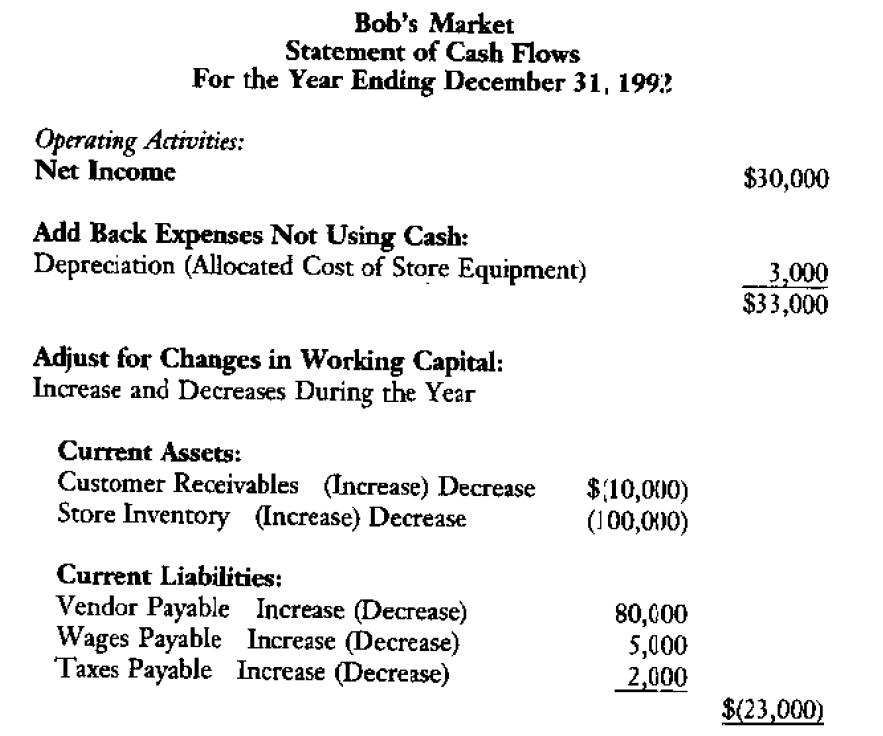

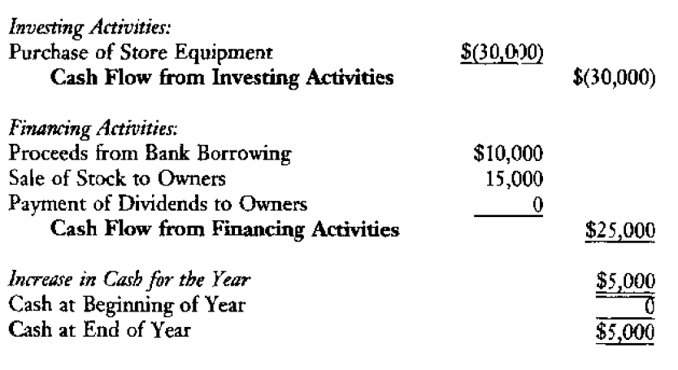

**Operating Activities**

**Investing Activities**

# 4. Ratio Analysis

- Liquidity measures:

  Current Ratio = Current Assets / Current Liabilities

- Capitalization measures

  Financial Leverage = (Total Liabilities + Owners' Equity) / OE

  Long-term Debt to Capital = Long-term Debt/(Liabilities + OE)

- Activity measures

  Asset Turnover per Period = Sales / Total Assets

  Inventory Turns per Period = Cost of Goods Sold / Average Inventory Held During the period

  Days Sales in Inventory = Ending Inventory / (Costs of Goods Sold/365)

- Profitability measures

  Return on Sales(ROS) = Net Income / Sales

  Return on Equity(ROE) = Net Income / Owners' Equity

The Du pont Chart

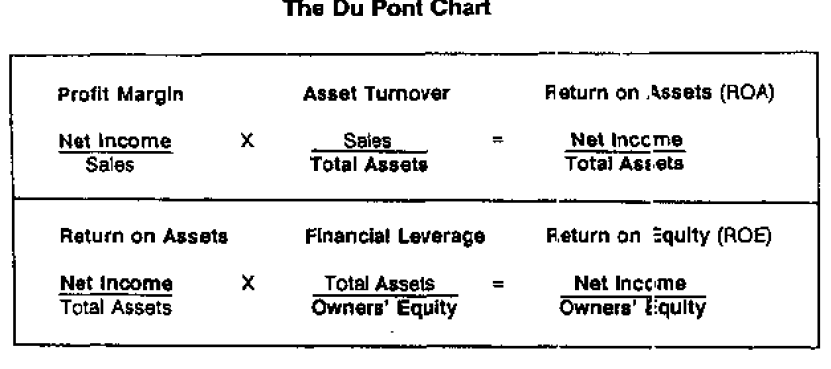

# 5. Managerial Accounting

Managerial accounting uses accounting data to manage and analyze operations.

**Price and Volume Variances**

Sales Price Variances
$$
(Actual\ Sales\ Price - Standard\ Sales\ Price) \times (Actual\ Quantity\ Sold) = Sales\ Price\ Variance
$$
Sales Volume Variances
$$
(Standard\ Sales\ Price) \times (Actual\ Quantity\ Sold - Standard\ Quantity\ Sold) = Sales\ Volume\ Variance
$$
**Purchase Price, Efficiency, and Volume Variances**
$$
Purchase\ Price\ Variance = (Standard\ Price - Actual\ Price) \times (Acutal\ Quantity\ Purchased\ or\ Used)
$$

$$
Material\ or\ Labor\ Efficiency\ Variance = (Standard\ Use\ Quantity - Actual\ Usage\ Quantity) \times (Standard\ Cost\ of\ Material\ or\ Labor)
$$

