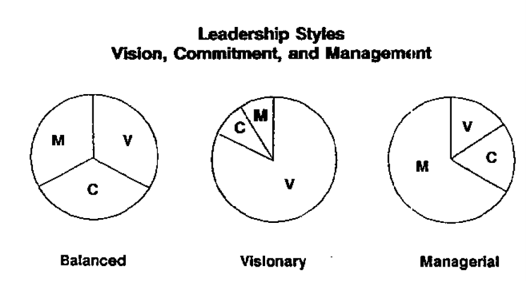

**Day 4 Organizational Behavior**

[TOC]

# Problem Solving Model

## Problem Definition

**Want Got Gaps** 

There is a problem when a gap or deviation between a manager think ought to be occurring and what is actually occurring.

The level of problem
- with in between certain people
- with in between groups
- with in between whole organization

**Source Problems and Casual Chain**

## Analysis
Link the problem to their cause

## Action Planning
1. Set Specific Goals
2. Define Activities,Resources Needed, Responsibilities
3. Set a Timetable for Action
4. Forecast Outcomes, Develop Contingencies
5. Formulate a Detailed Plan of Action in Time Sequence.
6. Implement, Supervise Execution, and Evaluate Based on Goals in Step One.

# Psychology Lesson

The APCFB Psychology Model

**Expectations**

**Beliefs**

**Values**

## Motivation

$$
Motivation = Expectation\ of\ Work\ Will\ Lead\ to\ Performance \times \\Expectation\ Performance\ Will\ lead\ to\ Reward \times Value\ of\ Reward
$$

## Job Design

## MBA Personality Traits -- Leadership

| Leaders shape goals                        | Managers react to events |
| ------------------------------------------ | ------------------------ |
| Leaders develop new ideas                  | Managers solve problems  |
| Leaders reach people on an emotional level |                          |
| Leaders take on challenges                 |                          |

Leadership VCM Model

- Vision
- Commitment
- Management Skills

- The Forces within the manager
- The Forces within the subordinates
- The forces of the situation

**Creativity**

**Active Listening**

- You Respond to Information and Don't lead
- You Respond to Personal Information and Don't Give Advice
- You Identify the Interviewee's Feelings as Well as the Content

# On-the-job Procedure

**Performance Appraisals**

Effective appraisals ought to have three types of goals:

- Organizational
- Feedback and Evaluation
- Coaching and Development

**Reprimands**

1. Check out the facts first
2. Give warning that you need to talk about the problem
3. Pause and express your displeasure
4. Display a caring attitude

**Managing your boss**

First, Understand bosses and their context:

- Their stated and unstated goals and objectives
- The pressures on them
- Their strengths, weaknesses, blind spots
- Their preferred work style

Second, Assess yourself and your needs:

- Your own strengths and weaknesses
- Your personal style
- Your predisposition toward dependence on or resistance to authority figures

Third, incorporate the first two steps and develop and maintain a relationship:

- Fists both your need and styles
- Is characterized by mutual expectations
- Keeps your boss informed - bosses hat surprises!
- Is based on dependability and honesty
- Selectively uses your boss's time and resources

# Power

Five types of power:

- Coercive - Failure to comply with a request could result in some form of purnishment
- Reward - based upon the expectation of receiving praise, recognition or income
- Referent - inspire and to attract followers
- Legitimate - due to the formal status held in the organization hierarchy
- Expert - technical specialist

**MBO management by objective**

Bosses delegate tasks by "negotiating" a contract of goals with their subordinates without dictating a detailed road map for implementation.

Is  appropriate when your staff is competent.

**MBWA management by walking around**

Managers should out of their offices working on building relationships, motivating, and keeping in direct touch with activities of the company.

# The Organizational Model And Structure

## Strategy

Strategy describes and explicit or implicit plan for success in the marketpace.

## Policies and Procedures

Policies are formal rules.

Procedures are the observable ways in which a company conducts business.

## Organizational Structure

- Functional
- Product
- Customer
- Geographic
- Divisional
- Matrix
- Amorphous

## Systems 

Each organization develops systems for allocating, controlling, and monitoring money, things, and people， gather information. System fall into six categories:

- Money Allocation,Control, and Monitoring
- Object Allocation, Control, and Monitoring
- People Allocation, Control and Monitoring
- Future Anticipation
- People Reward and Incentives
- Integrative

## Climate

Climate is a nebulous term that refers to the emotional state of an organization's members.

## Culture

Culture is the mix  of behaviors, thoughts, beliefs, symbols, and artifacts that are conveyed to people throughout an organization over time.

## The Human Talent Flow Pyramid

firm structure determine how employees are grouped, and how they can advance in a firm.

# System Theory

# Organizational Evolution And Revolution

**Situation --> Action Needed for Change**

- Company Lacks Information --> Education and Communication Tactics
- You Need Information and You Have Little Leverage --> Participation and Involvement Tactics
- Adjustment Problems --> Support and Facilitation Tactics
- Your Desired Change Will Cause Losses and Opponents Have Power to Block You --> Negotiation and Agreement Tactics
- You have No Alternatives and No Money for Facilitation --> Manipulation
- Speed Is Needed and  You Have the Power --> Explicit Orders and Coercion Tactics

