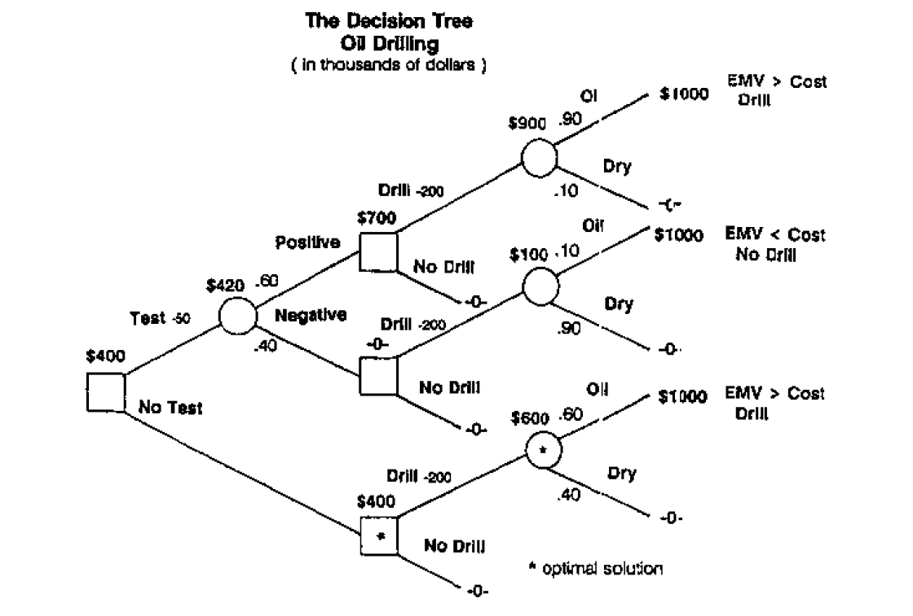
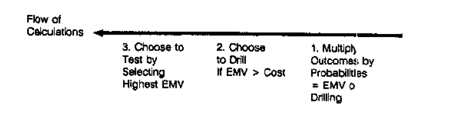
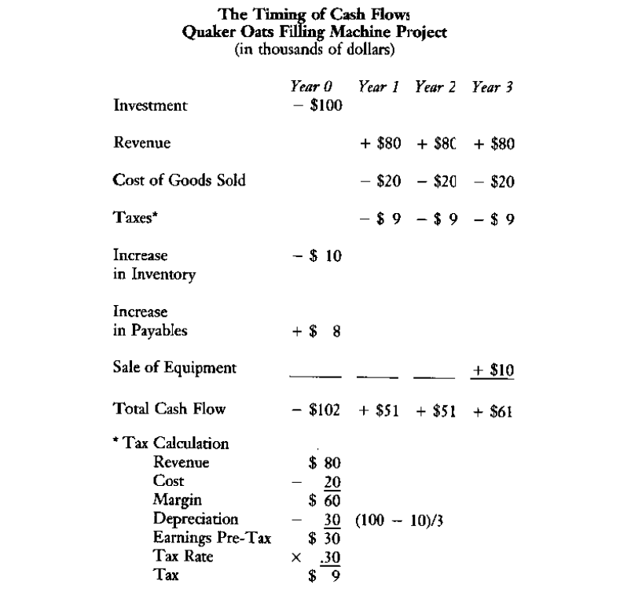
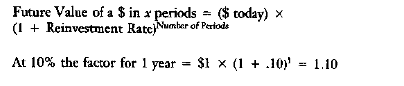
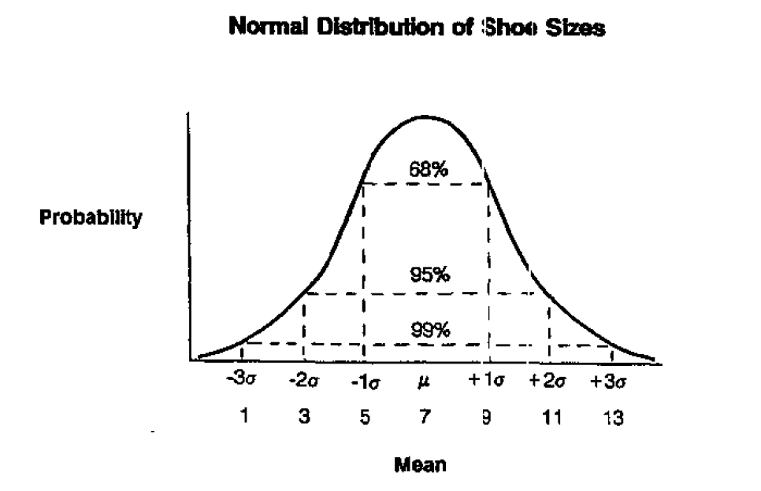
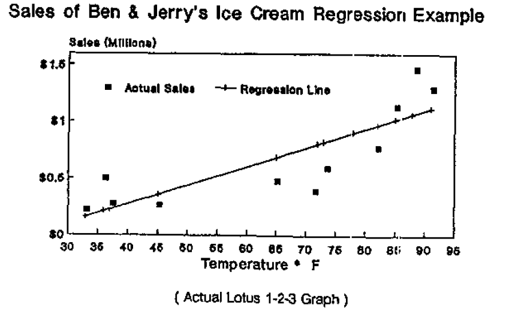

**Day 5 Quantitative Analysis**

[TOC]

# Decision Tree Analysis

1. Determine all the possible alternatives and risks associated with situation
2. Calculate the monetary consequences of each of the alternatives
3. Determine the uncertainty associated with each alternative
4. Combine the first three steps into a tree diagram
5. Determine the best alternative and consider the non-monetary aspect of the problem

# Cash Flow Analysis

What does the investment cost and how much cash will it generate each year?

What is the current investment and what are the future benefits?

1. Define the value of the investment
2. Calculate the magnitude of the benefits
3. Determine the timing of the benefits
4. Quantify the uncertainty of the benefits
5. Do the benefits justify the wait?

## Accumulated Value

## Net Present Value

## Internal Rate of Return(IRR)

IRR is the rate at which the discounted cash flows in the future equals the value of the investment today.

# Probability Theory

## Probability Distributions

Binomial distribution

Normal distribution

# Regression Analysis and Forecasting

## Linear Regression

R square

T statistic

